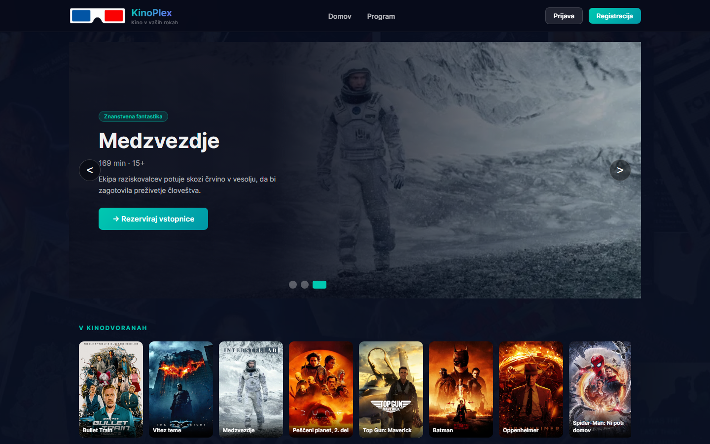
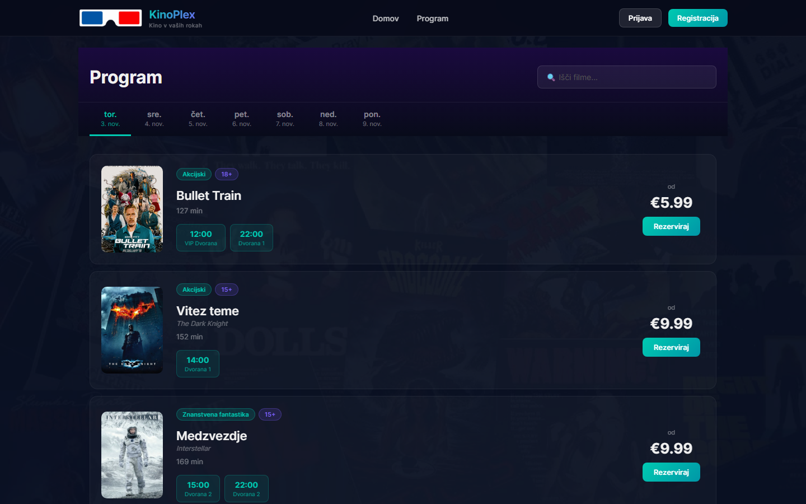
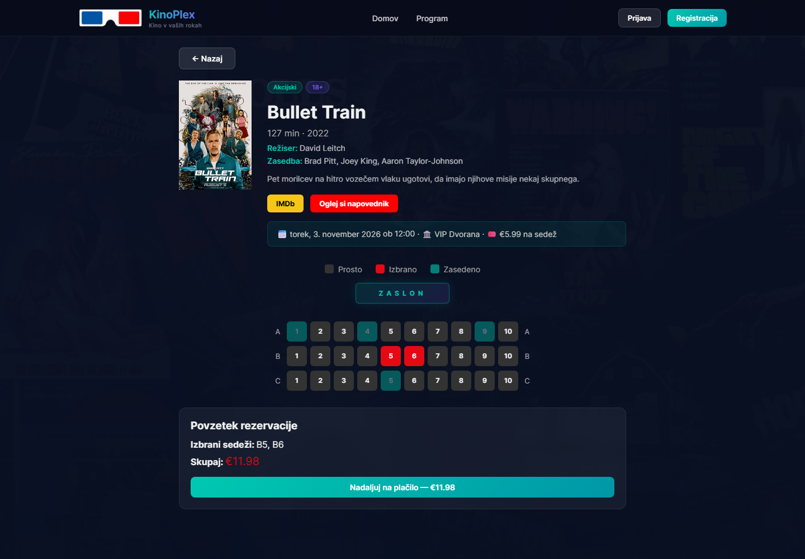

# KinoPlex Web

[](https://github.com/Horvatium/cinema-web/actions/workflows/ci.yml)

React web app for **KinoPlex**, a cinema ticket booking system. Customers browse the
programme, pick seats on an interactive seat map and pay online with Stripe. Admins manage
films, screenings, rooms and reservations. Built as my bachelor's thesis project and running
in production.

**Live site:** [kinoplex.si](https://www.kinoplex.si) ·
**API:** [cinema-api](https://github.com/Horvatium/cinema-api) ·
**Mobile app:** [cinema-mobile](https://github.com/Horvatium/cinema-mobile) ·
[Slovenska različica](README.md)



| Programme                                         | Seat selection                                                  |
| ------------------------------------------------- | --------------------------------------------------------------- |
|  |  |

## Features

- Film programme by day, with search
- Film details: synopsis, cast, director, IMDb link and trailer
- Interactive seat map showing free, selected and taken seats
- Online payment with Stripe Elements. Seats are held for 10 minutes while the customer pays,
  and the hold survives a page refresh.
- Registration with email verification; the session lives in an httpOnly cookie that JavaScript
  cannot read (no token in `localStorage`)
- "My tickets": view and cancel your own reservations
- Admin dashboard: films (with poster upload), screenings, rooms and all reservations

The booking logic, including the protection against two customers buying the same seat at once,
lives in the API. See the
[cinema-api README](https://github.com/Horvatium/cinema-api/blob/main/README.en.md#the-double-booking-bug).

## Tech stack

| Area           | Technology                                        |
| -------------- | ------------------------------------------------- |
| UI             | React 19, React Router 7                          |
| API client     | Axios with the session cookie (`withCredentials`) |
| Payments       | Stripe Elements (`@stripe/react-stripe-js`)       |
| Build          | Vite                                              |
| Tooling        | ESLint, Prettier, Vitest and Testing Library      |
| Infrastructure | Docker (nginx), GitHub Actions, Vercel            |

## Getting started

Requires Node.js 22 and a running [cinema-api](https://github.com/Horvatium/cinema-api).
The easiest way to get a local API with demo data is its Docker Compose setup.

```bash
git clone https://github.com/Horvatium/cinema-web.git
cd cinema-web
npm install
cp .env.example .env    # VITE_API_URL=http://localhost:5000/api
npm run dev
```

The app runs on <http://localhost:3000>. Without `VITE_API_URL` it uses the production
API at `https://api.kinoplex.si`.

Login does not work on Vercel preview deployments (`*.vercel.app`): they are not on the same site
as `api.kinoplex.si`, so the browser does not send the session cookie. Test login locally or on
kinoplex.si.

With a local API from the seed data, you can log in as `admin@kinoplex.test` / `Admin123!`
(admin) or `demo@kinoplex.test` / `Demo123!` (customer). These accounts exist only in the
local seed database.

### Docker

The image builds the app and serves it with nginx. The API URL is baked in at build time.

```bash
docker build --build-arg VITE_API_URL=http://localhost:5000/api -t cinema-web .
docker run -p 3000:80 cinema-web
```

The API repository's `docker compose --profile web up` builds and starts this app together
with the API and database.

### Tests

25 tests with Vitest and React Testing Library cover the login page, protected routes,
session handling in `AuthContext` (restoring the session via /auth/me, logout on expiry) and seat selection
on the film page. The API client is mocked, so the tests need no running API.

```bash
npm test
```

### Scripts

| Command                           | Description                      |
| --------------------------------- | -------------------------------- |
| `npm run dev`                     | Development server               |
| `npm run build`                   | Production build                 |
| `npm test` / `test:watch`         | Vitest (single run / watch mode) |
| `npm run preview`                 | Preview the production build     |
| `npm run lint`                    | ESLint, fails on warnings        |
| `npm run format` / `format:check` | Prettier                         |

## CI/CD

Every push and pull request runs [the CI workflow](.github/workflows/ci.yml): lint, Prettier
check, tests, a production build and a Docker image build.

Production deploys to Vercel **only after all of these pass**. Vercel's automatic Git deploys
for `main` are turned off in [`vercel.json`](vercel.json), and the workflow's deploy job
publishes with the Vercel CLI. Preview deployments for other branches still work as usual.

## Roadmap

- Enable the stricter ESLint rules for the React Compiler (`react-hooks/purity`, `immutability`, ...)

## Author

**Vid Gudič** · bachelor's thesis, CPU, 2026
